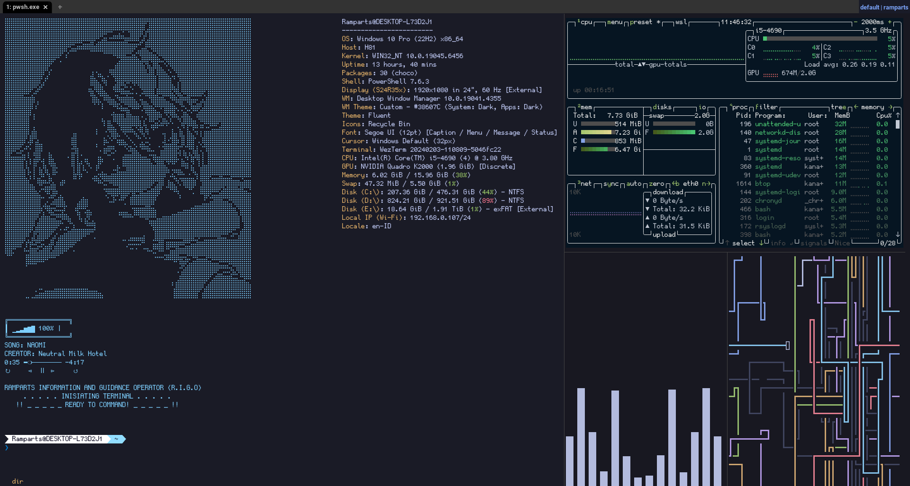

# Ramparts-Terminal

My WezTerm + PowerShell 7 terminal setup on Windows 10 — Tokyo Night theme, Oh My Posh prompt, custom Fastfetch ASCII logo, and a live system monitor sidebar.



## Stack

- [WezTerm](https://wezterm.org) — terminal emulator
- PowerShell 7
- [Oh My Posh](https://ohmyposh.dev) — prompt theme (`paradox`)
- [Fastfetch](https://github.com/fastfetch-cli/fastfetch) — system info, custom ASCII logo
- [GohuFont Nerd Font](https://www.nerdfonts.com/font-downloads) — `GohuFont11NerdFontMono`
- [Cava](https://github.com/karlstav/cava) — audio visualizer (native Windows)
- WSL (Ubuntu) — running `btop` and `pipes`

## Prerequisites

Install via `winget` (PowerShell, run as your normal user):

```powershell
winget install -e --id wez.wezterm
winget install -e --id Microsoft.PowerShell
winget install -e --id JanDeDobbeleer.OhMyPosh
winget install -e --id Fastfetch-cli.Fastfetch
winget install -e --id karlstav.cava
```

Then install the font: download **GohuFont11NerdFontMono** from [Nerd Fonts](https://www.nerdfonts.com/font-downloads) (search "Gohu" on that page), unzip, select the `.ttf` file, right-click → **Install**.

For `btop` and `pipes`, install WSL with Ubuntu first:

```powershell
wsl --install -d Ubuntu
```

Then inside the WSL shell:

```bash
sudo apt update
sudo apt install btop pipes
```

`pipes` installs to `/usr/games/pipes`. If typing `pipes` gives "command not found", that directory likely isn't in your `$PATH` — add an alias to fix it:

```bash
echo "alias pipes='/usr/games/pipes'" >> ~/.bash_aliases
source ~/.bashrc
```

## Installation

1. Clone or download this repo
2. Copy `wezterm/wezterm.lua` to `%USERPROFILE%\.wezterm.lua` (note the leading dot — rename it after copying)
3. Copy `fastfetch/ascii.txt` to `%USERPROFILE%\ascii.txt`
4. Find your PowerShell profile path by running `$PROFILE` in PowerShell 7, then copy the contents of `powershell/Microsoft.PowerShell_profile.ps1` into that file (create it if it doesn't exist)
5. Open WezTerm — it should now pick up `.wezterm.lua` automatically. If the font doesn't render correctly, confirm `GohuFont 11 Nerd Font Mono` is installed and restart WezTerm
6. Launch Cava separately (native Windows build) for the audio visualizer

## Keybindings (WezTerm)

| Keys | Action |
|---|---|
| `Ctrl+Shift+\|` | Split pane horizontally |
| `Ctrl+Shift+_` | Split pane vertically |
| `Ctrl+Shift+W` | Close current pane (with confirmation) |

## Known issues / Roadmap

- [ ] Move Cava to WSL (currently native Windows due to an unresolved audio routing issue)

## Credits

- Oh My Posh `paradox` theme by [JanDeDobbeleer](https://github.com/JanDeDobbeleer/oh-my-posh)
- GohuFont Nerd Font via [Nerd Fonts](https://www.nerdfonts.com)

## License

MIT — see [LICENSE](LICENSE)
